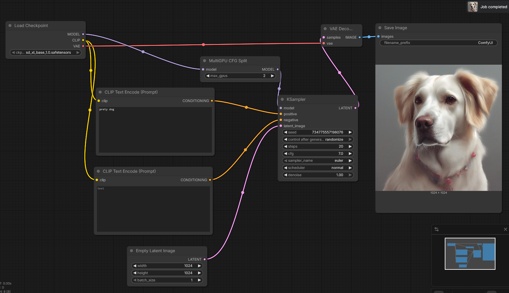

# XPU MultiGPU Support

## Problem

The MultiGPU CFG Split feature added in [PR #7063](https://github.com/Comfy-Org/ComfyUI/pull/7063) uses a `MultiGPUThreadPool` with `torch.cuda.set_device()` to assign worker threads to GPU devices.

On Intel XPU this crashes with:

```
MultiGPUThreadPool: failed to set device xpu:0: Expected a cuda device, but got: xpu:0
```

## Fix

### `set_torch_device(device)` helper

Added to `comfy/model_management.py`. Dispatches to the correct backend:

```python
def set_torch_device(device):
    if is_device_cuda(device):
        torch.cuda.set_device(device)
    elif is_device_xpu(device):
        torch.xpu.set_device(device)
    else:
        logging.debug(f"set_torch_device: no-op for device type '{device.type}'")
```

Replaces the hardcoded `torch.cuda.set_device()` calls in:

- `comfy/multigpu.py` — `MultiGPUThreadPool._worker_loop`
- `comfy/samplers.py` — `_handle_batch` in `_calc_cond_batch_multigpu`

## Thread Pool on XPU

`torch.xpu` exposes the same primitives as `torch.cuda`:

| Primitive | Available |
|---|---|
| `torch.xpu.set_device()` | ✅ |
| `torch.xpu.synchronize()` | ✅ |
| `torch.xpu.Stream` | ✅ |
| `torch.xpu.current_device()` | ✅ |

The `MultiGPUThreadPool` (Python threads, one per device) **does** parallelize work on XPU Windows — both GPUs run their forward passes concurrently. The thread pool is kept for all backends.

## Performance (2× Intel Arc A770, Windows 11)

Tested on Windows 11 with PyTorch 2.13.0.dev20260529+xpu.
Hardware: 2× Intel Arc A770 on PCIe Gen3 x16, dual Xeon E5-2699v3 (each GPU on its own CPU socket).

| Configuration | Steps | s/it (steady) | Total | Speedup |
|---|---|---|---|---|
| **1× A770** (no MultiGPU node) | 20 | 1.73–2.00 | 45–50s | 1× (baseline) |
| **2× A770** (+ MultiGPU CFG Split) | 20 | **1.10** | **31–38s** | **~1.7×** |

Model: [SDXL base 1.0](https://huggingface.co/stabilityai/stable-diffusion-xl-base-1.0) (`sd_xl_base_1.0.safetensors`), 1024×1024 → 2048×2048 (via SD Ultimate Upscale), CFG=7, 20 steps, Euler sampler.



## Branch

The fix is available in the `fix/xpu-multigpu-windows` branch:

```
https://github.com/savvadesogle/ComfyUI/tree/fix/xpu-multigpu-windows
```

Contains two commits:

1. `6030742f` — `set_torch_device()` helper: device-agnostic device switching
2. `ae35e23c` — diagnostic logging for the multigpu code path

